# 📸 QR Code Image Generator

### *Instant Photo Distribution Made Easy*

 

[?style=social)](https://github.com/yourusername/qr-code-image-generator/stargazers)

---

## 🎯 Project Overview

This project was developed to solve the challenge of **efficient photo distribution** at a university exhibition stall. Instead of traditional methods like email or messaging, visitors receive a **unique QR code** that provides instant access to their photos from any device.

**Designed and developed a web-based system using HTML and JavaScript** to expedite photo distribution at an exhibition stall outside the university. Captured visitor photos on entry, generated unique QR codes, and enabled secure viewing/download via any device, ensuring real-time processing and user-friendly access in a public event setting.

### 🎪 Built For Real-World Events
- Exhibition stalls and trade shows
- University events and career fairs
- Photo booths at conferences
- Corporate events and gatherings
- Community festivals and public events
- Brand activation campaigns

 

---

## ✨ Features

| Feature | Description |
|---------|-------------|
| 📷 **Real-time Photo Capture** | Capture visitor photos instantly using device camera or upload |
| 🔐 **Unique QR Code Generation** | Generate unique QR codes for each photo session |
| 📱 **Cross-Device Access** | View and download photos from any smartphone, tablet, or computer |
| ⚡ **Instant Processing** | Real-time QR code generation and photo access |
| 🎨 **User-Friendly Interface** | Simple, intuitive design for public event settings |
| 💾 **Secure Access** | Each QR code provides secure, unique access to specific photos |
| 📥 **Easy Download** | One-click photo download functionality |
| 🌐 **No Installation Required** | Works directly in web browsers |

---

## 🚀 How It Works

```mermaid
graph LR
    A[📷 Capture Photo] --> B[🔄 Process Image]
    B --> C[🔐 Generate QR Code]
    C --> D[📱 Display QR Code]
    D --> E[👤 Visitor Scans]
    E --> F[🖼️ View Photo]
    F --> G[📥 Download]
    
    style A fill:#ff6b6b
    style C fill:#4ecdc4
    style E fill:#45b7d1
    style G fill:#96ceb4
```

### 📋 Step-by-Step Process

1. **📸 Capture** - Take visitor's photo using device camera or upload
2. **⚙️ Generate** - System creates a unique QR code linked to the photo
3. **🎫 Share** - QR code is displayed/printed for the visitor
4. **📱 Scan** - Visitor scans QR code with their smartphone
5. **💾 Download** - Photo is displayed and can be saved instantly

---

## 🛠️ Technologies Used

<table>
<tr>
<td align="center" width="25%">

 <strong>HTML5</strong>
 Structure & Markup
</td>
<td align="center" width="25%">

 <strong>JavaScript</strong>
 Logic & Processing
</td>
<td align="center" width="25%">

 <strong>CSS3</strong>
 Styling & Design
</td>
<td align="center" width="25%">

 <strong>QR Code</strong>
 Code Generation
</td>
</tr>
</table>

